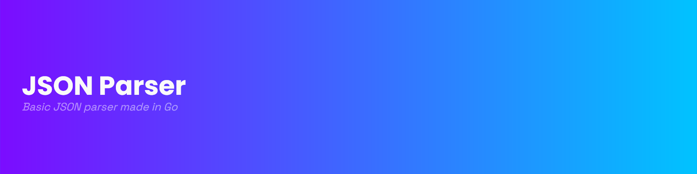

## Overview

This Go library provides a simple JSON parser that tokenizes a JSON string and parses it into Go data structures. It supports JSON objects, arrays, numbers, strings, booleans, and null values. The parser is lightweight and suitable for basic JSON processing.

## Key Features

- Tokenization: Converts a JSON string into individual tokens, such as {, }, [, ], ,, and :.

- Parsing: Supports parsing JSON objects and arrays into Go maps and slices, respectively.

- Primitive Types: Handles numbers (integers), booleans (true/false), strings and null.

- Error Tolerance: Handles common syntax issues gracefully.

## Limitations and Known Issues

- No Floating Point Numbers: The parser currently supports integers but does not handle floating-point numbers.

- Limited Error Handling: Syntax errors are not explicitly reported; instead, the parser just return nil without more info.

- No Escape Characters: Special characters within strings (like \ or \n) are not supported.

## Usage and Testing

You can find a CLI tool in the `cmd/jsonparser/main.go` showcasing how easy the library is to use.

## Contributions and Feedback

If you have any suggestions or ideas for improving the library, or if you've discovered a bug, I would greatly appreciate your feedback. Please feel free to submit a pull request or open an issue in the project repository.

## Credits

This project was developed by Fayçal Beghalia. Any use of this code is authorized, provided that proper credit is given.

## Example

```sh
faycal@FaycalLaptop:~/faycal/projects/json-parser$ go run cmd/jsonparser/main.go test.json
{
  "Humans": [
    {
      "age": 30,
      "name": "John"
    },
    {
      "age": 25,
      "name": "Jane"
    }
  ],
  "Myskills": null
}
```
